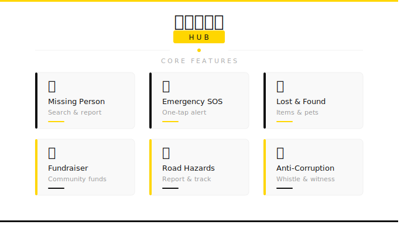

<div align="center">



<br/>

[](YOUR_DEMO_LINK_HERE)
[](YOUR_VIDEO_LINK_HERE)
[](YOUR_HACKATHON_LINK_HERE)

<br/>


</div>


<br/>

## 🧩 The Problem

> *Right now, when something goes wrong in your community — there is no single place to turn.*

When a dog goes missing, a road collapses, a child disappears, or a family needs emergency funds — citizens face a **fragmented maze**:

| ❌ Current Reality | ✅ With SahayogHub |
|---|---|
| Post on 5 Facebook groups, hope someone sees it | One upload. Instant community reach. |
| File complaints at government offices with zero follow-up | Geotagged reports with live status tracking |
| Search WhatsApp/Viber groups for a missing person | Searchable, centralized database |
| No transparent way to raise or track community funds | Public fundraising with full accountability |

**The solutions exist. They are just scattered, unmanaged, and inaccessible.**


## 💡 Our Solution

**SahayogHub** is a **unified civic platform** that consolidates all community-critical services — Lost & Found, Emergency SOS, Missing Persons, Fundraising, Road Hazards, and Corruption Reporting — into a **single, transparent, accountable application**.

```
Citizens report  →  Community sees  →  Authorities respond  →  Issues resolve
```


## 📸 Screenshots

<div align="center">

| 🏠 Dashboard | 🔍 Lost & Found | 🚨 Emergency SOS |
|:---:|:---:|:---:|
| `[Paste Screenshot]` | `[Paste Screenshot]` | `[Paste Screenshot]` |

| 🧑 Missing Person | 💰 Fundraiser | 🗺️ Hazard Map |
|:---:|:---:|:---:|
| `[Paste Screenshot]` | `[Paste Screenshot]` | `[Paste Screenshot]` |

</div>


## ⭐ Features — Priority Ranked

> Rated by **Civic Impact × Urgency × Build Feasibility**

<br/>

<details open>
<summary><strong>🧑 Missing Person Search &nbsp;|&nbsp; Impact: 10/10</strong></summary>

<br/>

A searchable, photo-driven database for missing persons. Citizens and law enforcement can **submit and browse** reports with photos, last known location, and contact details.

- 📷 Upload photos and identification details
- 🔎 Filter by region, age, date reported
- 📤 Share directly to social platforms from within the app
- 🔔 Notify contacts when a match is found

</details>

<br/>

<details open>
<summary><strong>🚨 Emergency SOS &nbsp;|&nbsp; Impact: 10/10</strong></summary>

<br/>

One-tap **geo-tagged emergency alerts** to local authorities or pre-set personal contacts. Built for speed when seconds count.

- 📍 Trigger SOS with real-time location share
- 🚒 Notify police, fire, or medical services instantly
- 🔴 Panic button optimized for vulnerable individuals

</details>

<br/>

<details open>
<summary><strong>🐾 Lost & Found &nbsp;|&nbsp; Impact: 8/10</strong></summary>

<br/>

No more scrolling through ten Facebook pages. Citizens upload **lost or found items** with photos, location, and contact details — all in one searchable feed.

- 🖼️ Post with image upload
- 🏷️ Tag by category: Pets · Electronics · Documents · Vehicles
- 📍 Geolocation tagging and date filtering
- 🔔 Auto-match alerts when a related post appears

</details>

<br/>

<details open>
<summary><strong>💰 Community Fundraiser &nbsp;|&nbsp; Impact: 8/10</strong></summary>

<br/>

A **transparent fundraising module** for medical emergencies, disaster victims, and education support. Every rupee is traceable.

- 📊 Live progress bars, donor counts, target amounts
- 🔍 **Public transparency dashboard** — all collections visible
- ✅ Verified campaign badges for trusted causes

</details>

<br/>


<details open>
<summary><strong>🏗️ Road & Public Hazard Reporting &nbsp;|&nbsp; Impact: 7/10</strong></summary>

<br/>

Citizens report **potholes, broken infrastructure, and public hazards** in real time. Reports are geotagged and escalated to the relevant municipal authority.

- 📸 Photo + location upload for any hazard
- 📋 Status tracking: `Reported` → `Acknowledged` → `Resolved`
- 👁️ Public visibility board to hold authorities accountable

</details>

<br/>

<details open>
<summary><strong>🔍 Corruption Awareness & Reporting &nbsp;|&nbsp; Impact: 9/10</strong></summary>

<br/>

A **whistleblower-friendly portal** where citizens can flag corrupt practices, upload evidence, and demand accountability — with full anonymity support.

- 📁 Submit reports with document/photo evidence
- 👤 Choose anonymous or identified reporting
- 👍 Community upvote system for visibility
- 📬 Auto-forward to relevant oversight bodies

</details>


## 🛠️ Tech Stack

<div align="center">

| Layer | Technology | Purpose |
|:---:|:---:|:---|
| **Frontend** |  | UI, routing, state management |
| **Backend** |  | REST API, auth, business logic |
| **Database** |  | PostgreSQL  |
| **Auth** |  | `[Specify: JWT / OAuth]` |
| **Maps** |  |  Google Maps |
| **Hosting** |  | Github |

</div>


## 🏗️ Architecture

```
┌──────────────────────────────────────────────────────────┐
│                    React Frontend                        │
│  Lost&Found │ Missing │ SOS │ Fundraiser │ Reports       │
└───────────────────────────┬──────────────────────────────┘
                            │  REST API (JSON)
┌───────────────────────────▼──────────────────────────────┐
│                   Django Backend                         │
│   Auth  │  Reports API  │  Alerts  │  Campaigns          │
└───────────────────────────┬──────────────────────────────┘
                            │
┌───────────────────────────▼──────────────────────────────┐
│                      Database                            │
│              PostgreSQL / SQLite                         │
└──────────────────────────────────────────────────────────┘
```


## 🗺️ Future Roadmap

| Priority | Feature | Description |
|:---:|---|---|
| 🔴 | **Theft Report System** | File and track theft complaints with evidence and case numbers |
| 🔴 | **Criminal Identification Search** | Search flagged individuals, linked to law enforcement |
| 🟡 | **AI Match Alerts** | Auto-match lost items & missing persons to new reports |
| 🟡 | **Government Service Integration** | Direct links to official e-gov portals |
| 🟢 | **Nepali Language Support** | Full localization for rural and broader reach |
| 🟢 | **Mobile App (React Native)** | Cross-platform iOS/Android version |


## 👥 The Team

<div align="center">

| Name | Role |
|:---:|:---:|
| **Kirtan Gurung** | Frontend Developer |
| **Binesh Adhikari** | Frontend Developer |
| **James Gurung** | Backend Developer |
| **Anil Shrestha** | Team Leader |

</div>


## 🏆 Built At

<div align="center">

**KMC HackVerse 2026** · Baaghbazar, Kathmandu

*May the best civic tech win.* 🇳🇵

</div>


## 📄 License

This project is licensed under the **MIT License** — see [LICENSE](LICENSE) for details.

<br/>

<div align="center">

**SahayogHub** — *Because every community problem deserves one unified solution.*

<br/>

⭐ **Star this repo** if you believe in civic tech for Nepal.

<br/>


&nbsp;&nbsp;


</div>
